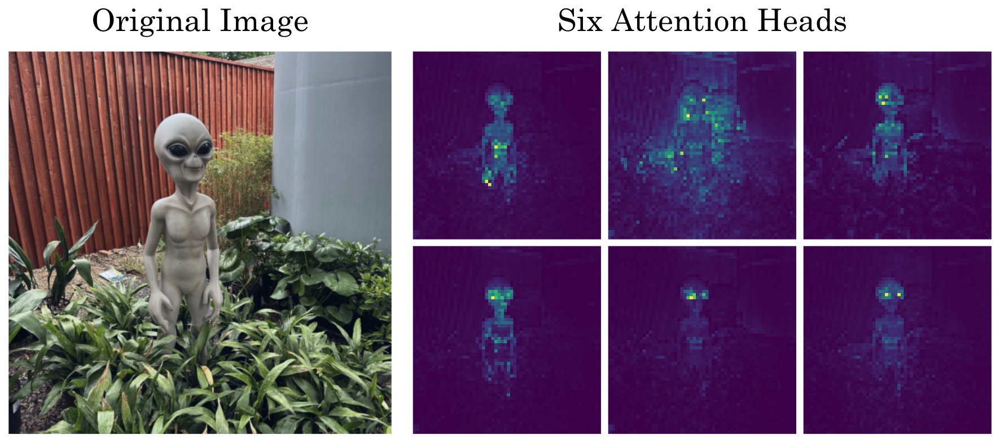
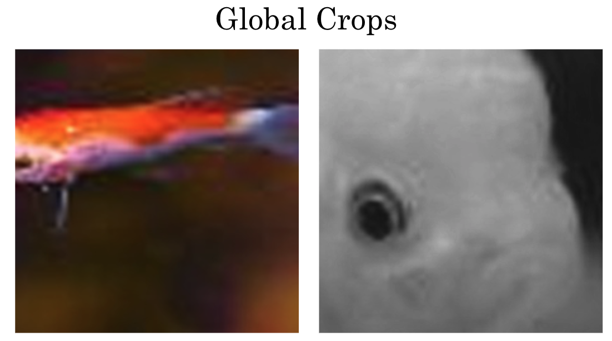
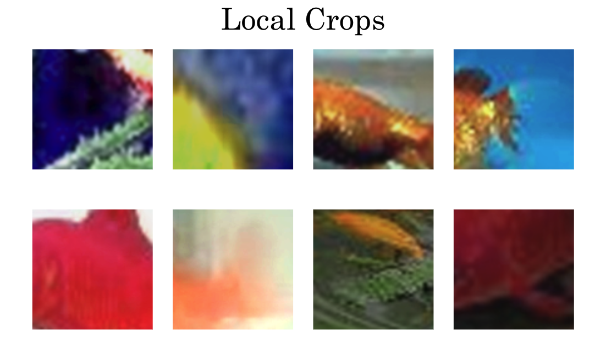

# DeepRob Class Project: Emerging Properties in Self-Supervised Vision Transformers

This work examines the paper [Emerging Properties in Self-Supervised Vision Transformers](https://arxiv.org/abs/2104.14294) by reproducing part of their experimental results and by exploring the use of weak supervision as an extension to the popular self-supervised learning method self-distillation with no labels (DINO). By incorporating minimal labeling information, we take advantage of the additional training information to provide a more diverse set of crops to the network architecture, which in turn provides a more targeted feature extraction.

## Paper Reproduction

In order to reproduce the results from ”Emerging Properties in Self-Supervised Vision Transformers”, the code provided by the authors was used with their pre-trained weights. We specifically used ViT-S/16 in three downstream tasks: KNN classification, and attention mapping.

### KNN classification
We use the dataset [Imagenet 1000 (mini)](https://www.kaggle.com/datasets/ifigotin/imagenetmini-1000), which is a subset of Imagenet 1k. It consists of the same 1000 classes, but for each label it has approximately 40 images in the training dataset. We found that with k=20, our model performance was 62.71%, versus 74.5% of the original DINO.

### Attention mapping
We use an image of an alien statue in a garden taken by one of our group mates, and visualize the DINO attention mapping. We see that most of the attention heads focus on the alien’s eyes, but all mostly ignore the background and direct the attention to the appropriate places in the image.

  

## Algorithmic Extension
One motivation for using weak supervision is to help stabilize the framework's sensibility to hyperparamters. Our key idea is that instead of relying on augmentation to do the work of creating crops of images that look different from each other, we could take advantage of weak supervision to just select the crops from different images with the same label.

## Conclusions
The successful integration of weak supervision with self-supervised learning methods presents exciting opportunities for advancing machine learning techniques in practical applications. By incorporating minimal labeling information, we have demonstrated significant use cases including the advantages and drawbacks of ViTs across various image processing tasks, compared to the original self-supervised DINO framework in semantic segmentation, kNN classification, and image recognition tasks.

